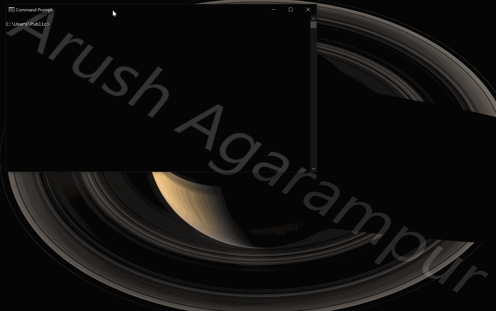

# ByeIntegrity 3.0 — Windows UAC Bypass
The third attack to bypass User Account Control (UAC) and gain elevated (Administrator) privileges to run any program at a high integrity level.

## How it works
ByeIntegrity 3.0 uses an elevated COM interface in combination with a shell protocol handler hijack in order to bypass UAC. If you're unfamiliar with autoelevated COM interfaces, visit the GitHub repo for ByeIntegrity 2.0 and read all about them over there.

Just like ByeIntegrity 2.0, an autoelevated COM interface is used in ByeIntegrity 3.0 — the CLSID `{E9495B87-D950-4AB5-87A5-FF6D70BF3E90}` represents the Security Center coclass. This coclass allows us to create an instance of the `IWscAdmin` interface defined by the IID `IID_IWscAdmin`. There is one specific method the interface exports which ByeIntegrity 3.0 uses: `DoModalSecurityAction()`. When used in combination with a shell protocol handler hijack, we are able to execute an elevated instance of an arbitrary program, in this case, `cmd.exe`, therefore bypassing UAC.

## How it was discovered
The Security Center coclass is located in the CPL `wscui.cpl`. So if you were wondering what "Security Center" means, it actually means the "Action Center" Control Panel page located at System and Security > Action Center. In fact, if you double click the `wscui.cpl` file, it will open the Control Panel and take you there.

Anyways, while reverse engineering the file, I found that the method `DoModalSecurityAction()` basically calls `ShellExecuteW()` or `ShellExecuteExW()` with different values based on the parameters given to it. But in the end, most of these calls to `ShellExecute(Ex)W()` involve opening an internet URL, meaning, the `lpFile` parameter of `ShellExecute(Ex)W()` begins with `http://...`.

This is where the shell protocol handler hijack comes into play. I figured out that changing the handler for `http` URL protocol allows us to execute an arbitrary program we specify. Because it will be launched as a child process of the elevated DCOM server `dllhost.exe`, the program will be elevated. Now this is where majority of the code comes into play.

In Windows 7 and earlier, it was easy to change the file/program/protocol associations — just write to the registry key `HKEY_CURRENT_USER\SOFTWARE\Microsoft\Windows\Shell\Associations\_UrlAssociations\http\UserChoice` with the correct `ProgId` value and you were done. Now with Windows 8 and later, the system is encrypted. Under the same registry key is a string value called `Hash`, which contains the unique hash for the current association settings. If the hash cannot be re-calculated with what's in the registry key, the check fails and the default program is used to open the specified file. Microsoft did this to combat rouge programs hijacking the user's file association settings, so even if a program did write to the registry in an attempt to change it, it would fail and remain unchanged or simply fall back to the default value.

Now this was something I needed to get around, so instead of trying to crack the algorithm, figure out what the algorithm is, etc., I decided to use the same mechanism Windows uses to set these associations. After monitoring what the Settings app does to set the associations, and after some reverse engineering, I found what I was looking for: a function called `UserAssocSet()` in `SystemSettings.Handlers.dll`. And in Windows 8/8.1, the function `UserAssocSet()` is in `shell32.dll`.

So most of the code is using pattern scanning to find the address of the function `UserAssocSet()` based on the current Windows version. Then, `UserAssocSet()` is called with the correct parameters to change the handler of the `http` URL protocol to `cmd.exe`. Once we use the `ShellExecute(Ex)W()` call from `IWscAdmin` in the elevated `dllhost.exe`, `cmd.exe` will launch as an elevated child process of `dllhost.exe` with Administrator privileges. Bazinga!

*Note: on Windows 10, `UserAssocSet()` calls `SetUserAssoc()`. ByeIntegrity 3.0 uses the pattern for `SetUserAssoc()` and calls that directly instead of finding and calling `UserAssocSet()`.*

## UACME
This attack is implemented in UACME as method #65. The implementation in UACME is the same as ByeIntegrity 3.0, except for one major difference. UACME uses `UserAssocSet()` from `shell32.dll` across all Windows versions, even Windows 10.

## Using the code
If you’re reading this then you probably know how to compile the source. Just note that this hasn’t been tested or designed with x86 in mind at all, and it probably won’t work on x86 anyways.

Just like UACME,  **I will never upload compiled binaries to this repo.**  There are always people who want the world to crash and burn, and I'm not going to provide an easy route for them to run this on somebody else's computer and cause intentional damage. I also don't want script-kiddies to use this attack without understanding what it does and the damage it can cause.

The code is pretty self-explanatory so I won't be commenting it this time.

## Supported versions

Technically, this attack works from Windows 7 (7600) up until the latest version of Windows 10. However, with every single new build of Windows 10, the implementation of `UserAssocSet()` is changed. And it was only at build 19041 that `UserAssocSet()` was defined in `SystemSettings.Handers.dll`. ByeIntegrity 3.0 was only tested and designed for Windows 7, 8/8.1, and Windows 10 build 19041/19042. It may work in the future or it may not. If you want something that'll work across all Windows versions, use UACME. It contains all the signatures for all existing Windows versions and will be updated to support new builds in the future, if the exploit has not been patched yet.
